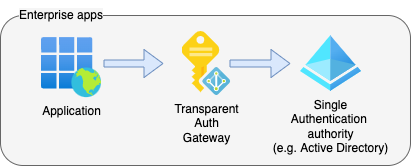

Code samples for a series of articles about implementing Transparent Auth Gateway:
1. [Needs and means](https://alex-klaus.com/transparent-auth-gateway-1). Requirements for enterprise apps and available off-the-shelf solutions.
2. [Auth Flows](https://alex-klaus.com/transparent-auth-gateway-2). Relevant authentication/authorisation flows (OAuth2, OIDC) with sequence diagrams.
3. [Writing the code in C#](https://alex-klaus.com/transparent-auth-gateway-3). Comments to the code in this repo – a _Transparent Auth Gateway_ in .NET.
4. [Deploying to Azure](https://alex-klaus.com/transparent-auth-gateway-4). _App Registrations_ and Firewall settings (Azure _WAF_ / _Front Door_).

# Transparent Auth Gateway for Enterprise apps

A trusted authority for our enterprise application(s) that
- transparently (without additional user interaction) confirms the identity with the linked _Identity Provider_ (an _Azure AD_ tenant in this case), supporting SSO;
- issues an _access token_ with app-specific attributes (user’s roles/groups/etc.);
- is self-hosted without reliance on third-party services.

The code uses _Azure AD_ as the linked _Identity Provider_ (for the identity checks) and an own bespoke authorisation server. 

The implemented protocols:
- OAuth 2 [Authorisation Code Flow](https://auth0.com/docs/get-started/authentication-and-authorization-flow/authorization-code-flow) ([RFC 6749](https://www.rfc-editor.org/rfc/rfc6749#section-4.1)) with [Proof Key for Code Exchange](https://www.oauth.com/oauth2-servers/pkce/) ([RFC 7636](https://www.rfc-editor.org/rfc/rfc7636))
- OpenID Connect ([OIDC](https://openid.net/connect/)).

# Code structure
There are 3 projects:

- [AzureADAuthClient](./AzureADAuthClient) – a quick way to ensure that _Azure AD_ authentication is configured. Uses Swagger UI to acquire a token and the standard `Microsoft.Identity` way to validate the token on WebAPI.
- [OpenIdDict.Server](./OpenIdDict.Server) – a bespoke _Transparent Auth Gateway_ that that implements OAuth 2 [Authorization Code Flow](https://auth0.com/docs/get-started/authentication-and-authorization-flow/authorization-code-flow) with [PKCE](https://oauth.net/2/pkce/) to serve other client apps as a trusted authority and perform authentication from a linked _Identity Provider_ (a specified tenant of Azure AD).
- [OpenIdDict.Client.Api](./OpenIdDict.Client.Api) – A Web API app that validates the _access token_ issued by a custom Auth Gateway along with a Swagger front-end to request the token and run HTTP requests against test end-points.

